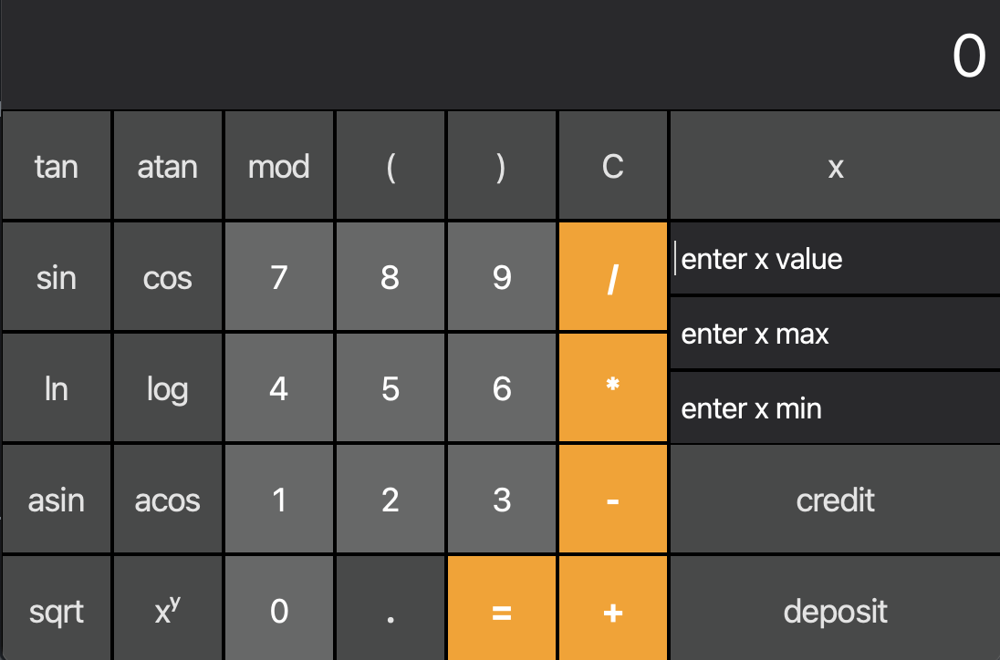
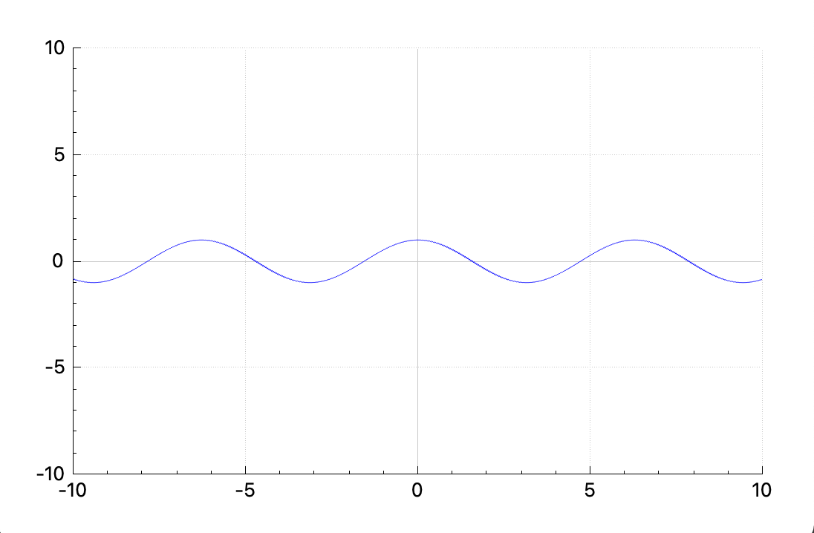

# SmartCalc v2.0

## Introduction
This project implements an extended version of the standard calculator in C++ in the object-oriented programming paradigm. In addition to basic arithmetic operations, such as plus-minus and multiply-divide, the calculator is supplemented with the ability to calculate arithmetic expressions with priority, as well as some mathematical functions (sine, cosine, logarithm, etc.). In addition to calculating expressions, the calculator also supports using the   x   variable and building the graph of the corresponding function. As an additional improvement, a credit calculator has been implemented.

The program is built using Makefile with a standard set of goals for GNU programs: all, install, uninstall, clean, dvi, dist, test, gcov_report.

Implementation with GUI, based on the Qt GUI library.

Construct a graph of a function defined by an expression in infix notation with variable x (with coordinate axes, notation of the scale used, and a grid with adaptive step). The definition area and value area of the functions are limited to at least the numbers -1000000 to 1000000.

## A special mode "loan calculator" is provided (calcus.ru is taken as an example):
- Input: amount of credit, loan term, interest rate, type of payments (annuity, differentiated)
- Outcome: monthly payment, accrued interest, debt + interest

## A special mode "deposit calculator" is provided (calcus.ru and banki.ru are taken as samples):
- Input: amount of period, placement period, start of term (date), interest rate, tax rate, interest capitalization, frequency of payments
- Outcome: income, tax, total deposit at the end of the period

